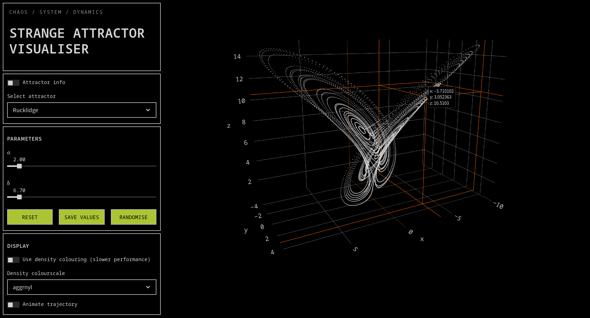

# Strange attractor visualiser



Streamlit app to visually explore and learn about [strange
attractors](https://en.wikipedia.org/wiki/Attractor)

## Running the app

```python
streamlit run main.py
```

## Features and usage

* View various strange attractors
* Alter parameter values to see how it affects the shape of the attractor
* Density colouring to show point distribution
* Background on each attractor with information on how each parameter affects it's
  shape
* Presets parameter values to generate interesting shapes
* Trajectory animation
