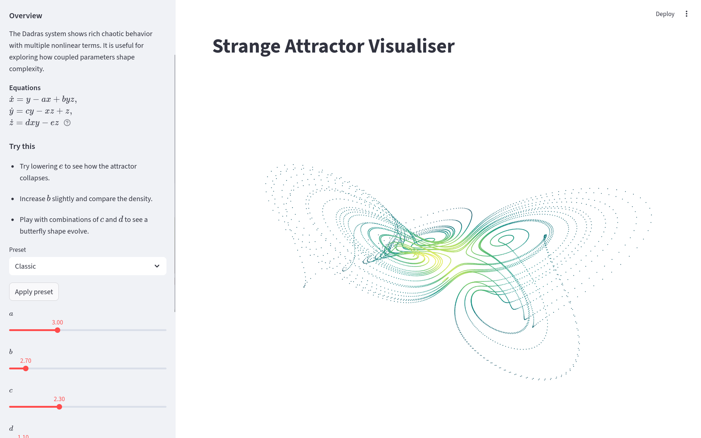

# Strange attractor visualiser



WIP

Streamlit app to visually explore and learn about [strange
attractors](https://en.wikipedia.org/wiki/Attractor)

## Running the app

```python
streamlit run main.py
```

## Features and usage

* View various strange attractors
* Alter parameter values to see how it affects the shape of the attractor
* Density colouring to show point distribution
* Trajectory animation

### Learn mode

The toggleable 'Learn mode' shows the equations for the chosen system, as well as some
additional information on the attractor, how the parameters affect the system and how to
generate some interesting shapes.
