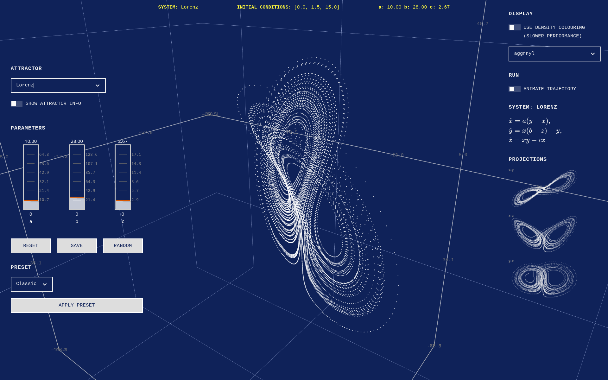
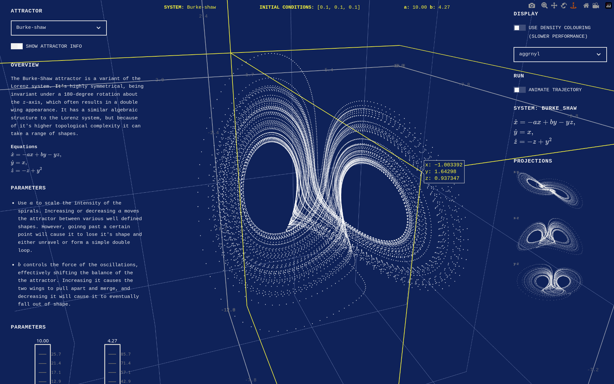
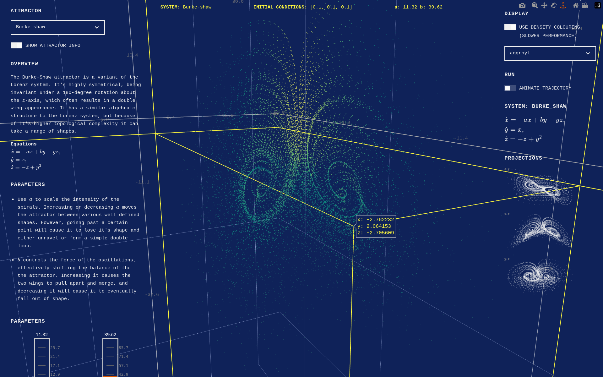
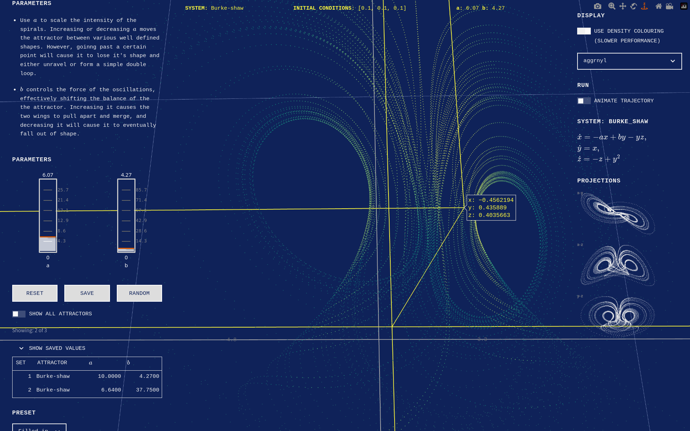

# Strange attractor visualiser

<div style="display: grid; grid-template-columns: 1fr 1fr; gap: 8px; max-width: 800px;">
  
  
  
  
</div>

Streamlit app to visually explore and learn about [strange
attractors](https://en.wikipedia.org/wiki/Attractor)

## Running the app

```python
streamlit run main.py
```

## Features and usage

* View various strange attractors
* Alter parameter values to see how it affects the shape of the attractor
* Density colouring to show point distribution
* Background on each attractor with information on how each parameter affects it's
  shape
* Preset parameter values to generate interesting shapes
* Trajectory animation


## Running locally

```python
git clone https://github.com/aymenhafeez/strange-attractor-visualiser
cd strange-attractor-visualiser/

python -m venv .venv
source .venv/bin/activate

pip install -e .

streamlit run main.py
```
